# Wizualizacja danych
## Lab 10. Biblioteka Matplotlib.

### **1. Wprowadzenie**

Na początku warto zapoznać się z nazewnictwem (angielskim) elementów, z których składa się widok wykresu. Poniższa grafika pozwoli na ich identyfikację i możliwość dostosowania wykresu do założeń lub potrzeb danego zadania/problemu.

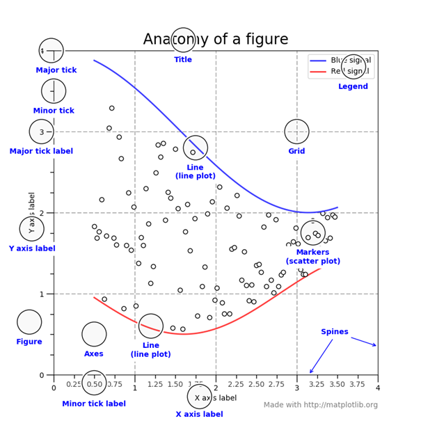

**Listing 1**
```python
import matplotlib.pyplot as plt

# bardzo prosty wykres liniowy
plt.plot([1, 2, 3, 4])
plt.ylabel('jakieś liczby')
plt.show()
```

Powyższy fragment kodu po jego uruchomieniu wygeneruje bardzo prosty wykres.

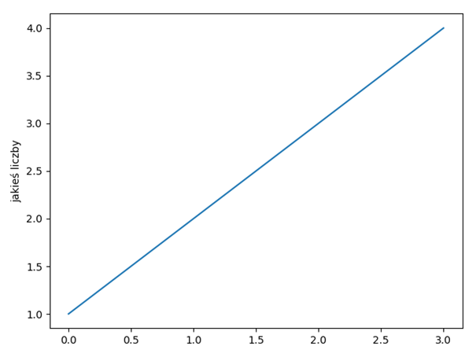

Wektor przekazanych wartości to oś Y, a oś X została wygenerowana automatycznie i tutaj dla wartości z wektora Y przyjmuje po prostu wartość indeksu z tej listy czyli dla wartości 1 przyjmuje wartość 0 itd. . Nie jest to zbyt przydatne w tym konkretnym przypadku.

### **2. Style wykresów.**

**Listing 2**
```python
import matplotlib.pyplot as plt

# przekazujemy dwa wektory wartości, najpierw dla wektora x, następnie y
# dodatkowo mamy tutaj przekazany parametr w postaci stringa, który określa styl wykresu
# dla pełnej listy sprawdź dokumentację pod adresem
# https://matplotlib.org/api/_as_gen/matplotlib.pyplot.plot.html#matplotlib.pyplot.plot
plt.plot([1, 2, 3, 4], [1, 4, 9, 16], 'ro-')
# tutaj określamy listę parametrów w postaci [xmin, xmax, ymin, ymax]
plt.axis([0, 6, 0, 20])
plt.show()

# możemy też ustawiać różne kolory dla poszczególnych elementów nakładając na siebie dwa wykresy
plt.plot([1, 2, 3, 4], [1, 4, 9, 16], 'r')
plt.plot([1, 2, 3, 4], [1, 4, 9, 16], 'o')

plt.axis([0, 6, 0, 20])
plt.show()
```

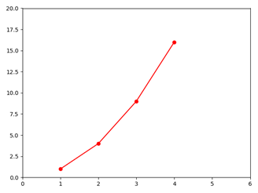
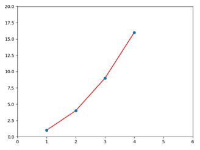

**Listing 3**
```python
import matplotlib.pyplot as plt
import numpy as np

# bazowy wektor wartości
t = np.arange(0., 5., 0.2)

# za pomocą pojedynczego wywołania funkcji plot() możemy wygenerować wiele wykresów na jednym "płótnie" (ang. canvas)
# każdorazowo podając niezbędne wartości: wartości dla osi x, wartości dla osi y, styl wykresu, ...
plt.plot(t, t, 'r--', t, t**2, 'bs', t, t**3, 'g^')
plt.show()
```

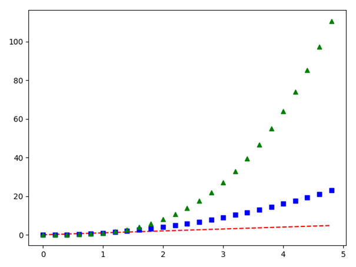

**Listing 4**
```python
import matplotlib.pyplot as plt
import numpy as np

x = np.linspace(0, 2, 100)

# wykresy mogą być też dodawane do płótna definicja po definicji zamiast w pojedynczym wywołaniu funkcji plot()
# tutaj użyty został również parametr label, który określa etykietę danego wykresu w legendzie
plt.plot(x, x, label='liniowa')
plt.plot(x, x**2, label='kwadratowa')
plt.plot(x, x**3, label='sześcienna')

# etykiety osi
plt.xlabel('etykieta x')
plt.ylabel('etykieta y')

# tytuł wykresu
plt.title("Prosty wykres")

# włączamy pokazywanie legendy
plt.legend()

plt.show()
```

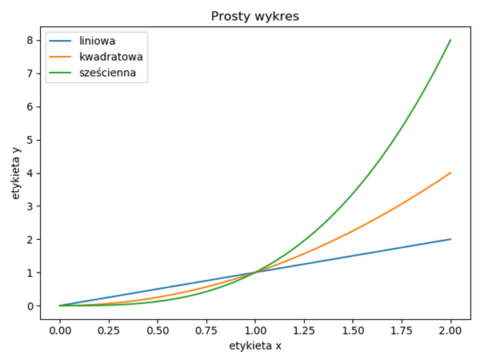

**Zadanie 1**  
Na wykresie wyświetl wykres liniowy funkcji f(x) = 1/x dla x ϵ [1, 20]. Dodaj etykietę do linii wykresu i wyświetl legendę. Dodaj odpowiednie etykiety do osi wykresu (‘x’, ’f(x)’) oraz ustaw zakres osi na (0, 1) oraz (1, długość wektora x).

**Zadanie 2**  
Zmodyfikuj wykres z zadania 1 tak, żeby styl wykresu wyglądał tak jak na poniższym zrzucie ekranu.

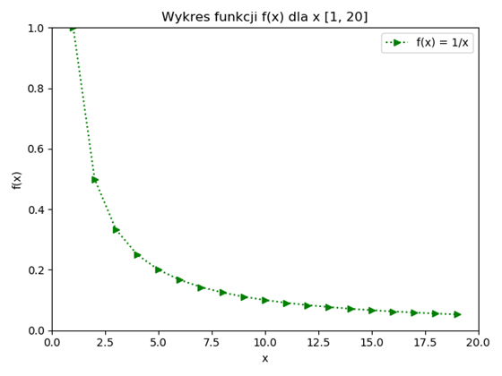

**Listing 5**
```python
import matplotlib.pyplot as plt
import numpy as np

x = np.arange(0, 10, 0.1)
s = np.sin(x)
plt.plot(x, s, label='sin(x)')

# etykiety osi
plt.xlabel('x')
plt.ylabel('sin(x)')

# tytuł wykresu
plt.title("Wykres sin(x)")

# umieszczamy legendę na wykresie
plt.legend()

plt.show()
```

Wyświetlanie wykresów funkcji trygonometrycznych jest również proste przy wspomaganiu biblioteki numpy, która wykonuje operacja na wektorze nie wymagając używania pętli( pamiętajmy też o Python comprehensions). Przy odpowiednio dużej ilość „próbek” wykres będzie gładki. Poeksperymentuj z ilością wartości wektora funkcji sin(x).

**Zadanie 3**  
Na jednym wykresie wygeneruj wykresy funkcji sin(x) oraz cos(x) dla x ϵ [0, 30] z krokiem 0.1. Dodaj etykiety i legendę do wykresu.

**Zadanie 4**  
Dodaj drugi wykres funkcji sinus do zadania 3 i zmodyfikuj parametry funkcji, tak aby osiągnąć efekt podobny do tego na poniższym zrzucie ekranu.

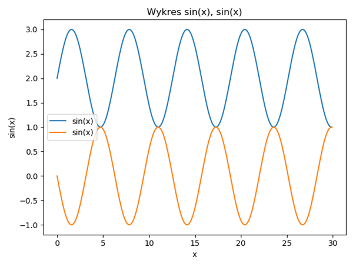

**Listing 6**
```python
import matplotlib.pyplot as plt
import numpy as np


# dane w formie słownika, ale równie dobrze może to być Pandas DataFrame
data = {'a': np.arange(50),
        'c': np.random.randint(0, 50, 50),
        'd': np.random.randn(50)}
data['b'] = data['a'] + 10 * np.random.randn(50)
data['d'] = np.abs(data['d']) * 100

# aby w ten sposób przekazać parametry wykresu należy dodać niezbędny parametr data, który zawiera dane dostępne poprzez etykiety
# to oznacza, że 'a' jest równoważne data['a'] itd. Parametr c to skrót od color, tutaj przekazywany w formie wektora
# wartości kolorów dla każdej kolejnej wartości wykresu. Parametr s to scale - określa rozmiar, w tym przypadku punktu, dla
# każdej kolejnej wartości wektora wykresu. Reasumując dla pierwszego punktu wykresu będą brane poniższe wartości
print(f"a={data['a'][0]}, b={data['b'][0]}, c={data['c'][0]}, d={data['d'][0]}")
plt.scatter('a', 'b', c='c', s='d', data=data)
plt.xlabel('wartość a')
plt.ylabel('wartość b')
plt.show()
```

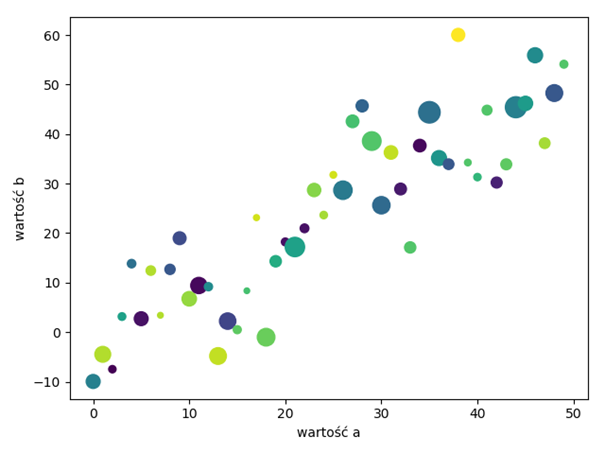

**Zadanie 5**  
Korzystając ze zbioru danych Iris (https://archive.ics.uci.edu/ml/datasets/iris) wygeneruj wykres punktowy, gdzie wektor x to wartość ‘sepal length’ a y to ‘sepal width’, dodaj paletę kolorów c na przykładzie listingu 6 a parametr s niech będzie wartością absolutną z różnicy wartości poszczególnych elementów wektorów x oraz y.

### **3. Podwykresy.**

Podwykresy pozwalają na umieszczanie na jednym płótnie wielu wykresów zorganizowanych w formie gridu. Podajemy wymiary gridu czyli liczbę wierszy oraz liczbę kolumn. Służy to tego funkcja subplot, która przyjmuje 3 argumenty (nrows, ncols, index). Odpowiednio jest to ilość wierszy gridu, ilość kolumn oraz indeks definiowanego właśnie wykresu (indeksy rozpoczynają się od 1 i kończą na nrows*ncols).

**Listing 7**
```python
import numpy as np
import matplotlib.pyplot as plt


x1 = np.arange(0.0, 2.0, 0.02)
x2 = np.arange(0.0, 2.0, 0.02)

y1 = np.sin(2 * np.pi * x1)
y2 = np.cos(2 * np.pi * x2)


plt.subplot(2, 1, 1)
plt.plot(x1, y1, '-')
plt.title('Dwa podwykresy')
plt.ylabel('sin(x)')

plt.subplot(2, 1, 2)
plt.plot(x2, y2, 'r-')
plt.xlabel('x')
plt.ylabel('cos(x)')

plt.show()
```

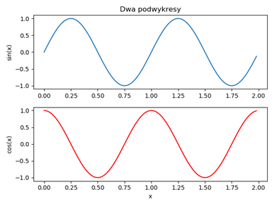

Możemy również pomijać umieszczanie wykresu w danym miejscu siatki.

**Listing 8**
```python
import numpy as np
import matplotlib.pyplot as plt


x1 = np.arange(0.0, 2.0, 0.02)
x2 = np.arange(0.0, 2.0, 0.02)
y1 = np.sin(2 * np.pi * x1)
y2 = np.cos(2 * np.pi * x2)

# oznacza, że mamy tutaj do czynienia z gridem 3x2 (3 wiersze, 2 kolumny) i definiujemy wykres o indeksie 1
plt.subplot(3, 2, 1)
plt.plot(x1, y1, '-')
plt.title('Dwa podwykresy')
plt.ylabel('sin(x)')

# możemy również pominąć przecinki, tu wykres o indeksie 4, więc pominęliśmy 2 oraz 3
plt.subplot(324)
plt.plot(x2, y2, 'r-')
plt.xlabel('x')
plt.ylabel('cos(x)')

plt.subplot(3, 2, 5)
plt.plot(x2, y2, 'r-')
plt.xlabel('x')
plt.ylabel('cos(x)')

plt.show()
```

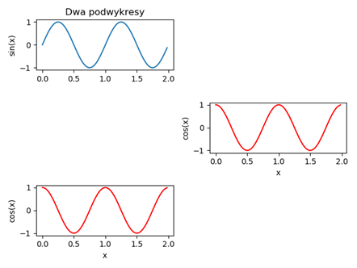

Poniższy listing przedstawia prosty przykład wykresu słupkowego.

**Listing 9**
```python
import numpy as np
import matplotlib.pyplot as plt

etykiety = ['K', 'M']
wartosci = [345, 435]

plt.bar(etykiety, wartosci)
# możemy również zmienić np. kierunek tekstu etykiet słupków
plt.xticks(rotation=45)
plt.ylabel('Ilość narodzin')
plt.xlabel('Płeć')
plt.show()
```

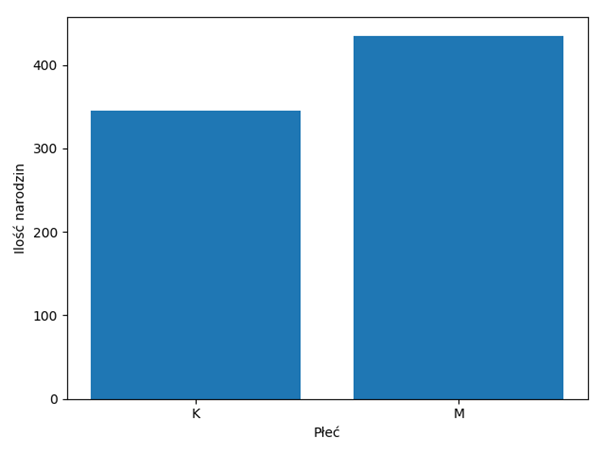

**Zadanie 6**  
Korzystając z biblioteki pandas wczytaj zbiór danych z narodzinami dzieci przedstawiony w lekcji 8. Następnie na jednym płótnie wyświetl 3 wykresy (jeden wiersz i 3 kolumny). Dodaj do wykresów stosowne etykiety. Poustawiaj różne kolory dla wykresów.  
1 wykres – wykres słupkowy przedstawiający ilość narodzonych dziewczynek i chłopców w całym okresie.   
2 wykres – wykres liniowy, gdzie będą dwie linie, jedna dla ilości urodzonych kobiet, druga dla mężczyzn dla każdego roku z osobna. Czyli y to ilość narodzonych kobiet lub mężczyzn (dwie linie), x to rok.  
3 wykres – wykres słupkowy przedstawiający sumę urodzonych dzieci w każdym roku.

**Zadanie 7**

Korzystając z tutoriala pod adresem https://towardsdatascience.com/matplotlib-tutorial-learn-basics-of-pythons-powerful-plotting-library-b5d1b8f67596 lub innego zmodyfikuj wykres 2 z zadania 6 tak, aby zamiast wykresu liniowego przedstawiał wykres łupkowy skumulowany (czyli jeden słupek dla kobiet i mężczyzn, ale składający się z dwóch „nałożonych” na siebie słupków). Przykład:


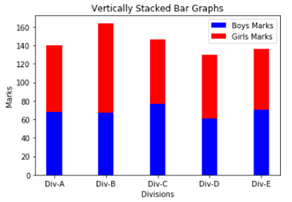

Popularnym typem wykresów dla zaprezentowania rozkładów prawdopodobieństwa są histogramy.

**Listing 10**
```python
import numpy as np
import matplotlib.pyplot as plt

x = np.random.randn(10000)

# bins oznacza ilość "koszy" czyli słupków, do których mają wpadać wartości z wektora x
# facekolor oznacza kolor słupków
# alpha to stopień przezroczystości wykresu
# density oznacza czy suma ilości zostanie znormalizowana do rozkładu prawdopodobieństwa (czyli przedział 0, 1)
plt.hist(x, bins=50, facecolor='g', alpha=0.75, density=True)


plt.xlabel('Wartości')
plt.ylabel('Prawdopodobieństwo')
plt.title('Histogram')
# wyświatlanie siatki
plt.grid(True)
plt.show()
```

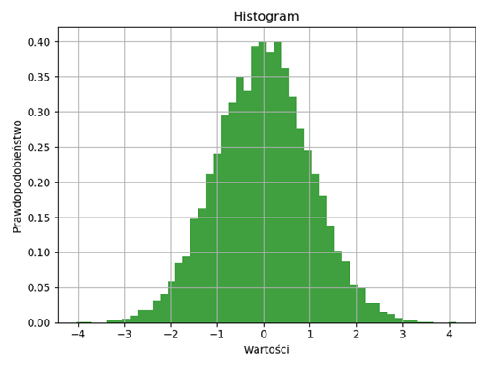

**Zadanie 8**  
Napisz funkcję, która losowo rzuca dwiema kostkami k6 n razy. Wynik rzutów zapisywany jest w postaci listy sum oczek z tych dwóch kostek. Np. rzucaj(6) generuje 6 rzutów kostkami i zwraca wektor 6 sum oczek każdego rzutu. Po zakończeniu funkcji wyświetlaj histogram sumy rzutów. Dodaj stosowne etykiety do wykresu.

**Listing 11**
```python
import numpy as np
import matplotlib.pyplot as plt

zawodnicy = ['Messi', 'Suarez', 'Dembele', 'Coutinho']
bramki = [48, 25, 13, 11]


# pierwsza wersja wykresu
wedges, texts, autotexts = plt.pie(bramki, labels=zawodnicy,
                                   autopct=lambda pct: "{:.1f}%".format(pct), textprops=dict(color="black"))
plt.setp(autotexts, size=14, weight="bold")
plt.title("Pierwsza wersja wykresu")
plt.legend(title='Zawodnicy')
plt.show()

# druga wersja wykresu
def prepare_label(pct, br):
    absolute = int(np.ceil(pct / 100. * np.sum(br)))
    return "{:.1f}% \n({}/{})".format(pct, absolute, sum(bramki))


wedges, texts, autotexts = plt.pie(bramki, labels=zawodnicy,
                                   autopct=lambda pct: prepare_label(pct, bramki), textprops=dict(color="black"))
plt.setp(autotexts, size=14, weight="bold")
plt.title("Druga wersja wykresu")
plt.legend(title='Zawodnicy')
plt.show()
```


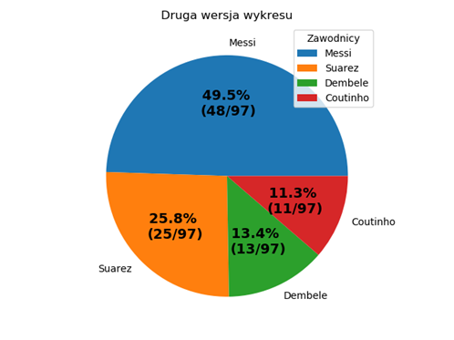

**Zadanie  9**  
Korzystając z pliku zamówienia.csv (Pandas) policz sumy zamówień dla każdego przedawcy i wyświetl wykres kołowy z procentowym udziałem każdego sprzedawcy w ogólnej sumie zamówień. Poszukaj w Internecie jak dodać cień do takiego wykresu i jak działa atrybut ‘explode’ tego wykresu. Przetestuj ten atrybut na wykresie.

**Zadanie 10**  
Poszukaj w bibliotece wykresów (https://matplotlib.org/gallery/index.html) przykładów z adnotacjami (annotating plots) na wykresach i dodaj adnotacje do dwóch wybranych stworzonych wcześniej wykresów.
