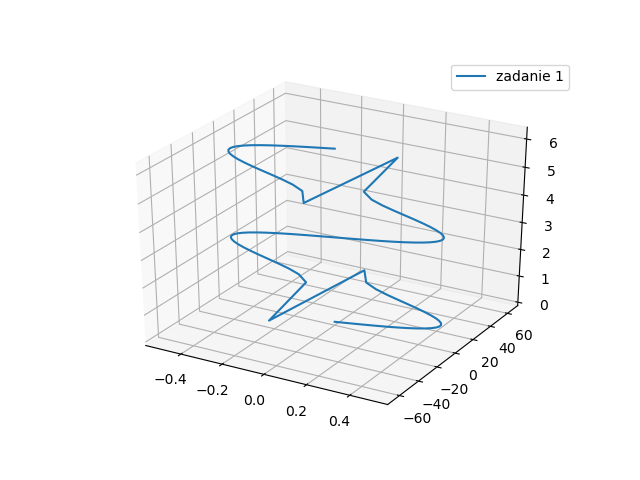
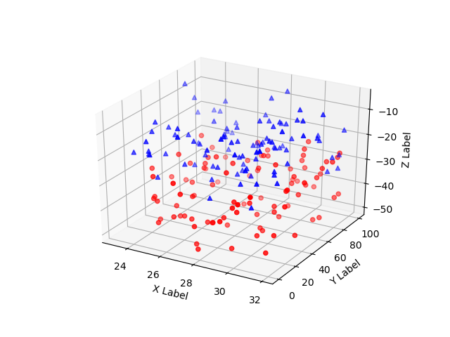
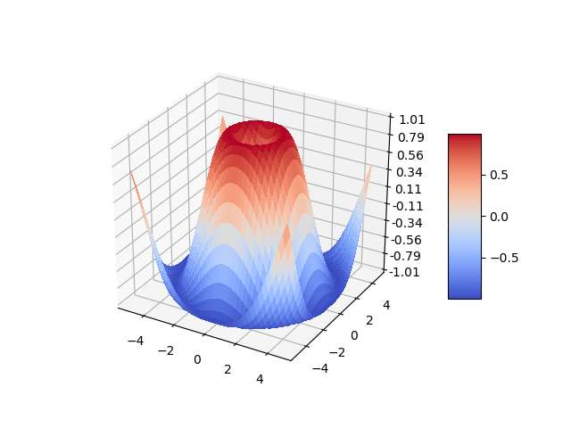
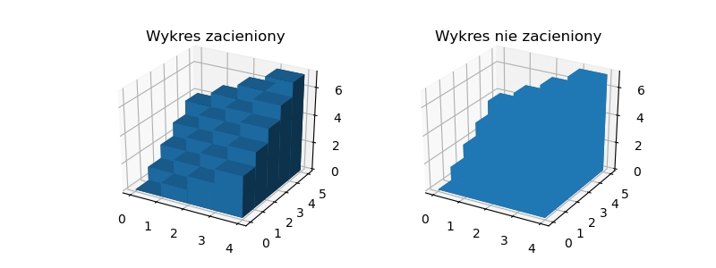
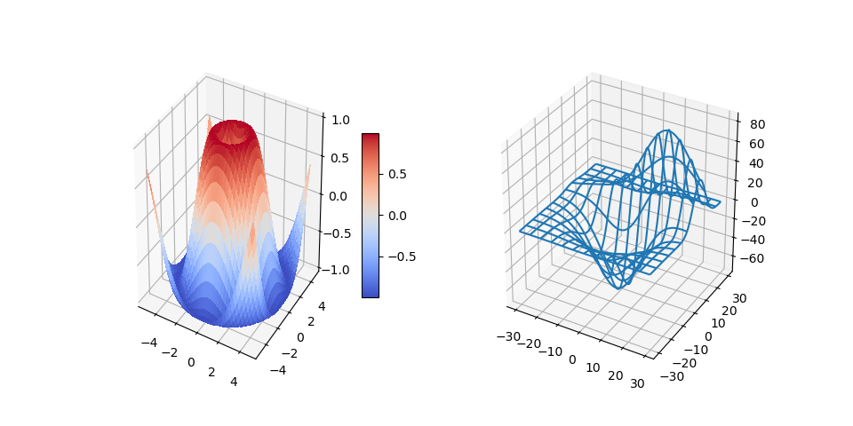
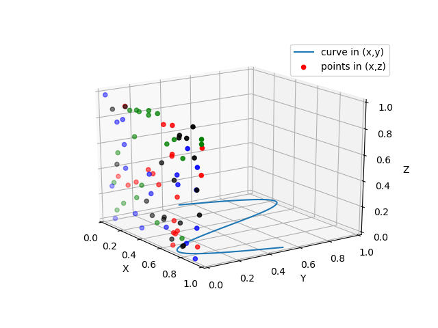

# Wizualizacja danych
## Lab 11. Biblioteka Matplotlib, część 2.

## **1. Wykresy 3D**

### **1.1 Wykresy liniowe**

Wykresy wygenerowane w postaci zewnętrznego okna są w pewnym stopniu interaktywne, można np. za pomocą myszki zmieniać kąt widzenia wykresów co pozwala przed zapisaniem wykresu w postaci pliku graficznego ustawic optymalny widok rzutu.


**Przykład 1**

```python
from mpl_toolkits.mplot3d import Axes3D
import numpy as np
import matplotlib.pyplot as plt


fig = plt.figure()
ax = fig.gca( projection = '3d' )

t = np.linspace( 0 , 2 * np.pi, 100 )
z = t
x = np.sin(t)*np.cos(t)
y = np.tan(t)
ax.plot(x, y, z, label = 'zadanie 1' )
ax.legend()
plt.show()
```

Wygenerowany wykres.



### **1.2 Wykresy punktowe**

**Przykład 2**
```python
import matplotlib.pyplot as plt
from mpl_toolkits.mplot3d import Axes3D
import numpy as np


# Ustawiamy seed by za każdym razem wyglądało identycznie
np.random.seed( 19680801 )


def randrange(n, vmin, vmax):
    '''
    Funkcja wspomagająca może tworzyć macierz losowych liczb o
    kształcie(n, )
    '''
    return (vmax - vmin)*np.random.rand(n) + vmin


fig = plt.figure()
ax = fig.add_subplot( 111 , projection = '3d' )
n = 100

# Dla każdego zbioru styli i zakresów wygeneruj n losowych punktów
# zdefiniowane przez x z [23, 32], y in [0, 100], z z [zlow, zhigh].
for c, m, zlow, zhigh in [( 'r' , 'o' , - 50 , - 25 ), ( 'b' , '^' , - 30 , - 5 )]:
    xs = randrange(n, 23 , 32 )
    ys = randrange(n, 0 , 100 )
    zs = randrange(n, zlow, zhigh)
    ax.scatter(xs, ys, zs, c =c, marker =m)

ax.set_xlabel( 'X Label' )
ax.set_ylabel( 'Y Label' )
ax.set_zlabel( 'Z Label' )
plt.show()
```

### **1.2 Wykres powierzchniowy**

Wygenerowany wykres.



**Przykład 3**

```python
import matplotlib.pyplot as plt
from mpl_toolkits.mplot3d import Axes3D
from matplotlib import cm
from matplotlib.ticker import LinearLocator, FormatStrFormatter
import numpy as np


fig = plt.figure()
ax = fig.gca( projection = '3d' )
# generuj dane.
X = np.arange(- 5 , 5 , 0.25 )
Y = np.arange(- 5 , 5 , 0.25 )
X, Y = np.meshgrid(X, Y)
R = np.sqrt(X** 2 + Y** 2 )
Z = np.sin(R)
# rysuj powierzchnię.
surf = ax.plot_surface(X, Y, Z, cmap =cm.coolwarm,
linewidth = 0 , antialiased = False )
ax.set_zlim(- 1.01 , 1.01 )
ax.zaxis.set_major_locator(LinearLocator( 10 ))
ax.zaxis.set_major_formatter(FormatStrFormatter( '%.02f' ))
# Dodanie paska kolorów.
fig.colorbar(surf, shrink = 0.5 , aspect = 5 )
plt.show()
```

Wygenerowany wykres.



**Przykład 4**
```python
import numpy as np
import matplotlib.pyplot as plt
from mpl_toolkits.mplot3d import Axes3D


# konfiguracja wielkości wykresu, figsize określa wielkość wykresu w calach
fig = plt.figure( figsize =( 8 , 3 ))
ax1 = fig.add_subplot( 121 , projection = '3d' )
ax2 = fig.add_subplot( 122 , projection = '3d' )
# fikcyjne dane
_x = np.arange( 4 )
_y = np.arange( 5 )
_xx, _yy = np.meshgrid(_x, _y)
x, y = _xx.ravel(), _yy.ravel()
top = x + y
bottom = np.zeros_like(top)
width = depth = 1
ax1.bar3d(x, y, bottom, width, depth, top, shade = True )
ax1.set_title('Wykres zacieniony')
ax2.bar3d(x, y, bottom, width, depth, top, shade = False )
ax2.set_title('Wykres nie zacieniony')
plt.show()
```

Wygenerowany wykres.



**Zadanie 1**  
Wygeneruj wykres liniowy dla z od 0 do 2*pi, x = sin(z), y = 2*cos(z).

**Zadanie 2**  
Wygeneruj wykres punktowy dla 5 różnych losowych serii z użyciem różnych znaczników i kolorów: https://matplotlib.org/api/markers_api.html

**Zadanie 3**  
Wygeneruj wykres z przykładu 3 w 5 różnych kolorystkach:
https://matplotlib.org/examples/color/colormaps_reference.html

**Zadanie 4**  
Wygeneruj z pomocą dokumentacji wykres słupkowy z przykładu 4 wykorzystując 5 różnych kombinacji wyglądu.

## **2. Wiele wykresów w jednym wywołaniu.**

**Przykład 5**

```python
import matplotlib.pyplot as plt
from matplotlib import cm
import numpy as np
from mpl_toolkits.mplot3d.axes3d import get_test_data
# rejestrowanie projekcji 3d.
from mpl_toolkits.mplot3d import Axes3D


# szerokość 2 razy większa niż wysokość
fig = plt.figure( figsize =plt.figaspect( 0.5 ))
#===============
# Pierwszy wykres
#===============
# osie dla pierwszego wykresu
ax = fig.add_subplot( 1 , 2 , 1 , projection = '3d' )
X = np.arange(- 5 , 5 , 0.25 )
Y = np.arange(- 5 , 5 , 0.25 )
X, Y = np.meshgrid(X, Y)
R = np.sqrt(X** 2 + Y** 2 )
Z = np.sin(R)
surf = ax.plot_surface(X, Y, Z, rstride = 1 , cstride = 1 ,
cmap = cm.coolwarm,
linewidth = 0 , antialiased = False )
ax.set_zlim(- 1.01 , 1.01 )
fig.colorbar(surf, shrink = 0.5 , aspect = 10 )
#===============
# Drugi wykres
#===============
# Osie dla drugiego wykresu
ax = fig.add_subplot( 1 , 2 , 2 , projection = '3d' )
X, Y, Z = get_test_data( 0.05 )
ax.plot_wireframe(X, Y, Z, rstride = 10 , cstride = 10 )
plt.show()
```

Wygenerowany wykres.



**Zadanie 5**  
W przykładzie 3 zmień gęstość próbek do wykresu na krok 0.1 oraz włącz antyaliasing. Wyświetl pierwotny i nowy wykres obok siebie.

**Zadanie 6**  
Wygeneruj 2 wykresy: pierwszy punktowy zawierający 20 punktów, drugi zawierający wykres liniowy składający się z 5 punktów.

## **3. Wiele typów wykresów w jednej przestrzeni.**

**Przykład 6**
```python
# Projekcja 3d
from mpl_toolkits.mplot3d import Axes3D
import numpy as np
import matplotlib.pyplot as plt


fig = plt.figure()
ax = fig.gca( projection = '3d' )
x = np.linspace( 0 , 1 , 100 )
y = np.sin(x * 2 * np.pi) / 2 + 0.5
ax.plot(x, y, zs = 0 , zdir = 'z' , label = 'curve in (x,y)' )
colors = ( 'r' , 'g' , 'b' , 'k' )
np.random.seed( 19680801 )
x = np.random.sample( 20 * len(colors))
y = np.random.sample( 20 * len(colors))
c_list = []
for c in colors:
    c_list.extend([c] * 20 )

# przez użycie zdir='y', wartość y dla tych punktów jest równe zs czyli 0
# punkty (x,y) są nakładane na osiach x i z.
ax.scatter(x, y, zs = 0 , zdir = 'y' , c =c_list, label = 'points in (x,z)' )

# Limity dla legendy
ax.legend()
ax.set_xlim( 0 , 1 )
ax.set_ylim( 0 , 1 )
ax.set_zlim( 0 , 1 )
ax.set_xlabel( 'X' )
ax.set_ylabel( 'Y' )
ax.set_zlabel( 'Z' )
# Ustawienie kąta nachylenia przy generowaniu wykresu
# oś y=0
ax.view_init( elev = 20. , azim =- 35 )
plt.show()
```



**Zadanie 7**  
Połącz 2 wykresy z zadania 5 w jeden. Odpowiednio formatując wykresy spróbuj osiągnąć efekt jakby była to gra Snake, w której zielony wąż próbuje zjeść czerwone jabłka.