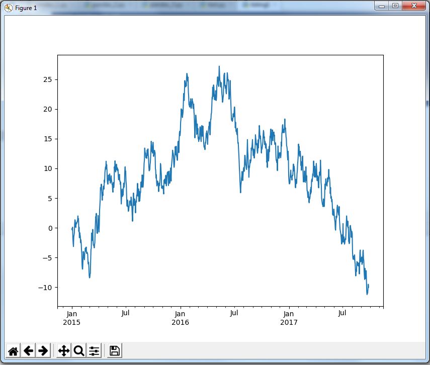
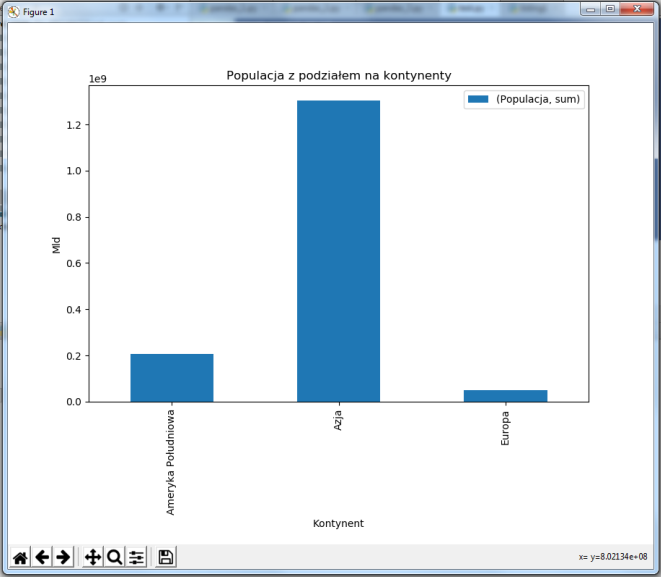
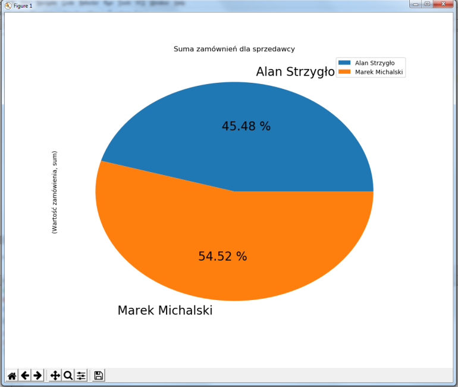
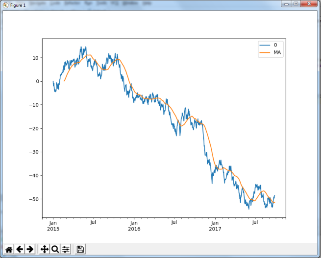

# Wizualizacja danych
## Lab 9. Biblioteka pandas, część 2.

### **1. Pandaas i wykresy.**

**Listing 1** – wykres liniowy na postawie serii danych

```python

import pandas as pd
import numpy as np
import matplotlib.pyplot as plt


# korzystając z funkcji random oraz date_range możemy wygenerować szereg czasowy danych
ts = pd.Series(np.random.randn(1000), index=pd.date_range('1/1/2015', periods=1000))
# funkcja biblioteki Pandas generująca skumulowana sumę kolejnych elementów
ts = ts.cumsum()
print(ts)
ts.plot()
plt.show()
```

**Wykres 1**



**Listing 2** – wykres kolumnowy z Pandas DataFrame
```python
import pandas as pd
import matplotlib.pyplot as plt


data = {'Kraj': ['Belgia',  'Indie',  'Brazylia', 'Polska'],
'Stolica': ['Bruksela',  'New Delhi',  'Brasilia', 'Warszawa'],
'Kontynent': ['Europa', 'Azja', 'Ameryka Południowa', 'Europa'],
'Populacja': [11190846, 1303171035, 207847528, 38675467]}
df = pd.DataFrame(data, columns=['Kraj',  'Stolica', 'Kontynent', 'Populacja'])
print(df)

grupa = df.groupby(['Kontynent']).agg({'Populacja':['sum']})
print(grupa)
wykres = grupa.plot.bar()
wykres.set_ylabel('Mld')
wykres.set_xlabel('Kontynent')
wykres.legend()
plt.title('Populacja z podziałem na kontynenty')
plt.show()
```



**Listing 3** – wczytanie danych z pliku i wyświetlenie zgrupowanych wartości
```python
import pandas as pd
import matplotlib.pyplot as plt

df = pd.read_csv('dane.csv', delimiter=';')
grupa = df.groupby(['Imię i nazwisko']).agg({'Wartość zamówienia':['sum']})
# wykres kołowy z wartościami procentowymi sformatowanymi z dokładnością do 2 miejsc po przecinku
# figsize ustawia wielkość wykresu w calach, domyślnie [6.4, 4.8].
wykres = grupa.plot.pie(subplots=True, autopct='%.2f %%', fontsize=20, figsize=(6, 6))
plt.title('Suma zamównień dla sprzedawcy')
plt.show()
```


zawartość pliku ‘dane.csv’
```csv
Imię i nazwisko;Data;Wartość zamówienia
Marek Michalski;2018-01-10;1200.0
Marek Michalski;2018-01-21;456.5
Alan Strzygło;2018-01-22;350.0
Marek Michalski;2018-01-23;800.0
Alan Strzygło;2018-01-24;349.0
Alan Strzygło;2018-01-26;1350.0
```



**Listing 4** – zmodyfikowana wersja listingu 1 z dodatkowym wykresem średniej kroczącej
```python
import pandas as pd
import numpy as np
import matplotlib.pyplot as plt


# korzystając z funkcji random oraz date_range możemy wygenerować szereg czasowy danych
ts = pd.Series(np.random.randn(1000), index=pd.date_range('1/1/2015', periods=1000))
# funkcja biblioteki Pandas generująca skumulowana sumę kolejnych elementów
ts = ts.cumsum()
#rzutowanie Serien na DataFrame
df = pd.DataFrame(ts)
# dodanie nowej kolumny i wykorzystanie funkcji rolling do stworzenia kolejnych wartości średniej kroczącej
df['MA'] = df.rolling(window=50).mean()
df.plot()
plt.show()
```



### **2. Zadania**
Korzystając ze zbiorów danych z lab 8 wykonaj poniższe zadania.

**Zadanie 1**  
Stwórz wykres liniowy, który wyświetli liczbę urodzonych dzieci dla każdego roku.

**Zadanie 2**  
Stwórz wykres słupkowy, który wyświetli liczbę urodzonych chłopców i dziewczynek z całego zbioru.

**Zadanie 3**  
Wykres kołowy z wartościami % ukazującymi ilość urodzonych chłopców i dziewczynek w ostatnich 5 latach z datasetu.

**Zadanie 4**  
Z repozytorium UCI (http://archive.ics.uci.edu/ml/index.php) pobierz dataset Iris i za pomocą wykresu punktowego (scattered) wyświetl wartość 2 wybranych cech tego datasetu. Dla każdego rodzaju kwiatu użyj innego koloru na wykresie. Przykład można znaleźć w galerii wykresów biblioteki matplotlib - link w materiałach matplotlib.

**Zadanie 5**  
Wyświetl na pomocą wykresu słupkowego ilość złożonych zamówień przez poszczególnych sprzedawców (zbiór danych zamówienia.csv).